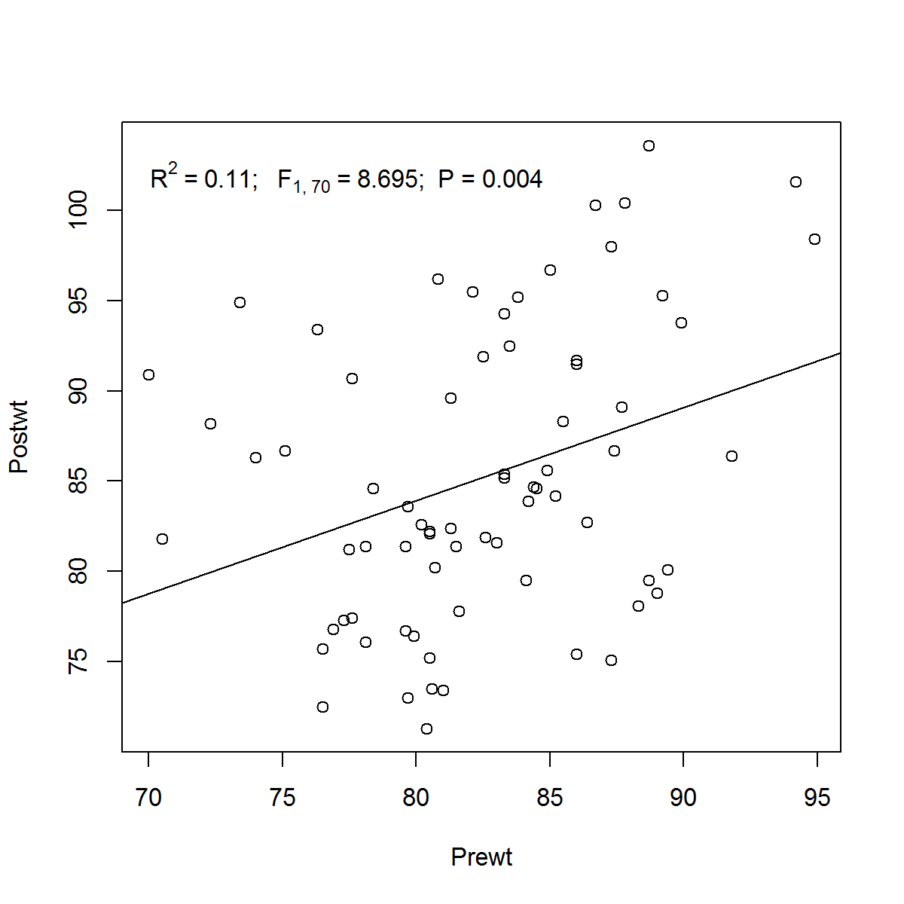

ResulteR is a set of functions that generate strings of text for the use in markdown documents. It aims to help you build top level reproducible documents.

## Installing


```r
install.packages("devtools")
library(devtools)
install_github("eduardohet/resulteR")
library(resulteR)
```

## Trying it out

### T-tests

```r
res <- t.test(extra ~ group, data = sleep)
sleep.res <- tText(res)

# Cheatsheet to produce the following neatly formatted result: 
# Now you just need to add your result with an inline call to that text string. Here you could say that means are similar in both sleep groups (`r sleep.res`).
```
Now you just need to add your result with an inline call to that text string. Here you could say that means are similar in both sleep groups (t~17.8~ = -1.861; P = 0.079).

### Regression

```r
utils::data(anorexia, package = "MASS")
anorex.1 <- lm(Postwt ~ Prewt, data = anorexia)
anorexia.pre <- lmText(anorex.1)

# Cheatsheet to produce the following neatly formatted result: 
# In this case, there was no association between weight in pre- and post-treatment when treatments are not taken into account (`r anorexia.pre`).
```
In this case, there was no association between weight in pre- and post-treatment when treatments are not taken into account (R^2^ = 0.11; F ~1,~ ~70~ = 8.695; P = 0.004). 


```r
anorexia$Treat <- relevel(anorexia$Treat, ref="Cont")
anorex.2 <- lm(Postwt ~ Treat + Prewt, data = anorexia)
anorexia.full <- lmText(anorex.2)
anorexia.ft <- lmText(anorex.2, type="coefs", which.coef="TreatFT")
anorexia.CBT <- lmText(anorex.2, type="coefs", which.coef="TreatCBT")

# Cheatsheet to produce the following neatly formatted result:
# However, not always our models contain only one variable. Therefore we may need to word our results a little bit  differently. For instance, when we take treatment and pre-weight into account, we reach a significant result (`r anorexia.full`) and function `lmText` takes care to appropriately change from regular to adjusted-R² ($\\bar{R}^{2}$). By further looking into the results, we see that patients in family (`r anorexia.ft`) and cognitive  behavioural (`r anorexia.CBT`) treatments improved weight over patients in the control group.
```
However, not always our models contain only one variable. Therefore we may need to word our results a little bit differently. For instance, when we take treatment and pre-weight into account, we reach a significant result ($\bar{R}^{2}$ = 0.246; F ~3,~ ~68~ = 8.713; P < 0.001) and function `lmText` takes care to appropriately change from regular to adjusted-R² ($\bar{R}^{2}$). By further looking into the results, we see that patients in family (*b* = 8.66; t = 3.949; P < 0.001) and cognitive behavioural (*b* = 4.097; t = 2.164; P = 0.034) treatments improved weight over patients in the control group.

### Regression plots

In addition to test results inline in your texts, what about including the key results of your regression in your plot? Just ckeck out the figure below. 

```r
plot(Postwt ~ Prewt, data = anorexia)
abline(anorex.1)
plotlmText(anorex.1, h=0.15, v=0.8, pos=4)
```




### Anova

```r
anorex.1 <- aov(Postwt ~ Treat + Prewt, data = anorexia)
aov.treat <- aovText(anorex.1, which.coef="Treat")
aov.prewt <- aovText(anorex.1, which.coef="Prewt")

# Cheatsheet to produce the following neatly formatted result:
# Depending on the type of data in your analysis, you may have to report your results differently. For example, the analysis of anorexia treatment has two independent variables: treatment (Treat) and weight of patient before study period (Prewt). While this is actually an analysis called Ancova, some may want to represent its results by F and P-values for the two variables instead of betas from regressions. Therefore, one may say that there is an effect of both treatment (`r aov.treat`) and weight of patient before study period (`r aov.prewt`).
```
Depending on the type of data in your analysis, you may have to report your results differently. For example, the analysis of anorexia treatment has two independent variables: treatment (Treat) and weight of patient before study period (Prewt). While this is actually an analysis called Ancova, some may want to represent its results by F and P-values for the two variables instead of $\beta$s from regressions. Therefore, one may say that there is an effect of both treatment (F ~2,~ ~68~ = 9.436; P < 0.001) and weight of patient before study period (F ~1,~ ~68~ = 7.266; P = 0.009).

### Correlations

```r
res <- cor.test(~Postwt + Prewt, data=anorexia)
pearson.cor <- corText(res)
res <- cor.test(~Postwt + Prewt, data=anorexia, method="spearman")
spearman.rho <- corText(res, digits=c(3, 1, 3))
res <- cor.test(~Postwt + Prewt, data=anorexia, method="kendall")
kendall.tau <- corText(res)

# Cheatsheet to produce the following neatly formatted result:
# Another commonly used set of analysis is that of correlations. Let's have a look on the output of such analysis on the relationship of weight before and after treatment in the anorexia dataset. Below, we will apply the three methods available in function `cor.test`:

# 1. Pearson's product-moment correlation: weight of patients correlated positively with their weights after the treatment (`r pearson.cor`)...
```
Another commonly used set of analysis is that of correlations. Let's have a look on the output of such analysis on the relationship of weight before and after treatment in the anorexia dataset. Below, we will apply the three methods available in function `cor.test`:

1. Pearson's product-moment correlation: weight of patients correlated positively with their weights after the treatment (r = 0.332; t~70~ = 2.949; P = 0.004).
2. Spearman's rank correlation &rho;: weight of patients correlated positively with their weights after the treatment ($
ho$ = 0.344; S = 40789.9; P = 0.003).
3. Kendall's rank correlation &tau;: weight of patients correlated positively with their weights after the treatment ($	au$ = 0.246; z = 3.049; P = 0.002).

### Descriptive statistics

```r
# Simple mean and standard deviation of a numeric vector
mean.postwt <- meansdText(anorexia$Postwt)
prewt <- with(anorexia, split(Prewt, list(Treat)))
postwt <- with(anorexia, split(Postwt, list(Treat)))
meandiff.cont <- meansdText(postwt$Cont-prewt$Cont)
meandiff.ft <- meansdText(postwt$FT-prewt$FT)

# Cheatsheet to produce the following neatly formatted result:
# What about describing your data? Let's have a look on the anorexia dataset again. The mean and standard deviation of weights after the treatment is `r mean.postwt` lb. Having a look on patients in the control group, it seems that most lost weight (mean difference postwt-prewt: `r meandiff.cont` lb), whereas patients receiveing the family treatment improved their weight (`r meandiff.ft` lb).
```
What about describing your data? Let's have a look on the anorexia dataset again. The mean and standard deviation of weights after the treatment is 85.2 $\pm$ 8 lb. Having a look on patients in the control group, it seems that most lost weight (mean difference postwt-prewt: -0.4 $\pm$ 8 lb), whereas patients receiveing the family treatment improved their weight (7.3 $\pm$ 7.2 lb).

### Neat lists 

```r
x <- c("apples", "oranges", "grapes")
fruits <- tidyList(x)
numbers <- tidyList(c(2.3, 5.4, 3), sep="; ", dec=",", last="&")
```
The last function in the package is a small one to produce lists of any stuff you want. You may either list some fruits: apples, oranges, and grapes, or some numbers: 2,3;  5,4;  & 3. You may format the output as you wish. A final hint: this may be useful to grab names of significant parameters from a model result.
